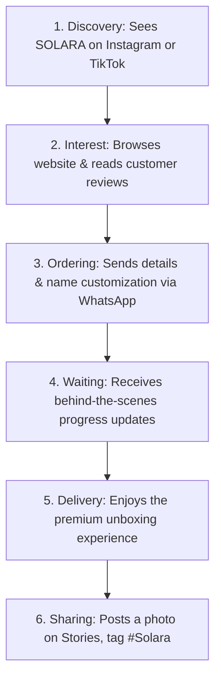

# SOLARA — Simplified Brand Documentation

This document compiles the core strategy, branding, and marketing plans for **SOLARA** in simple English. It is prepared for our meeting discussion.

---

## Chapter 1: Brand Foundation

### 1.1 Introduction
SOLARA is an Egyptian handmade summer brand. We sell personalized summer bags, hats, and beach accessories. Our main focus is **customization**. We add the customer's name or initials to every piece using laser engraving or embroidery. 

We target middle and upper-class women (Class A and Upper B) in Egypt. These women spend their summers in upscale beach destinations like the North Coast (Marassi, Hacienda), Gouna, and Dahab.

### 1.2 The Problem in the Market
Currently, the summer accessories market in Egypt has several issues:
1. **No Luxury Customization**: Most brands sell the exact same designs. No major competitor offers high-quality name engraving.
2. **Poor Handmade Quality**: Many handmade products have issues like loose threads, weak stitching, and no inner lining.
3. **Faux Materials**: Some brands sell cheap fake leather at the price of real leather.
4. **Easy to Copy**: Many designs are basic. Local workshops copy them easily.
5. **Slow Digital Shopping**: Buying handmade products online in Egypt is often slow and complicated.

### 1.3 The SOLARA Solution
SOLARA solves these problems by offering:
1. **Premium Personalization**: We engrave names on real leather patches or embroider them with water-resistant cotton thread.
2. **Excellent Quality**: Every bag has a canvas lining, strong brass zippers, and clean stitching.
3. **Genuine Materials**: We use natural straw, real leather, and high-grade cotton.
4. **Hard-to-Copy Designs**: We combine different elements like pearls, leather, and metal, making our products unique.
5. **Easy Online Ordering**: Customers can easily browse and order through Instagram, WhatsApp, and our Shopify store.

### 1.4 Mission & Vision
* **Mission**: To empower women to carry a unique summer piece that displays their personal identity and is made with love.
* **Vision**: To become the leading personalized handmade summer brand in Egypt by 2028 and expand to international markets via Etsy.

---

## Chapter 2: Market Strategy

### 2.1 Market Research & Insights
* **The Location Strategy**:
  * **North Coast & Gouna (Premium)**: Customers prefer structured bags made of leather and straw with laser-engraved names. They care about luxury and prestige.
  * **Dahab & North Coast (Bohemian/Family)**: Customers prefer relaxed, colorful crochet bags, cotton items, and large durable totes for family trips.
* **Buying Behavior**:
  * Shopping starts early in **April and May** before the summer travel season.
  * Fast replies on social media (under 15 minutes) double the chance of a sale.
  * Premium packaging and a great "unboxing experience" encourage customers to share photos online.

### 2.2 Product Pricing
We position ourselves in the **"Masstige" (affordable luxury)** price range:
* **Large Beach Totes**: EGP 2,200 – 3,500 *(40-50% profit margin)*
* **Crossbody Bags & Clutches**: EGP 1,200 – 1,800 *(45-55% profit margin)*
* **Embroidered Sun Hats**: EGP 650 – 950 *(55-65% profit margin)*

### 2.3 Competitor Analysis
We analyzed the top competitors in Egypt:

| Brand | What They Do | Their Strength | Their Weakness |
| :--- | :--- | :--- | :--- |
| **Khoos** | Eco-luxury straw bags | Strong brand story & website | No personalization |
| **KOFFA** | Bohemian carpet bags | Very unique designs | Not summer-focused, weak customization |
| **Simplicity** | Hand-painted art bags | Large organic social reach | Very expensive, not focused on gifting |

> [!TIP]
> **SOLARA's Advantage**: We do not compete on home storage or eco-activism. We focus entirely on **personalized gifting** and **luxury summer lifestyle**.

### 2.4 SWOT Analysis
* **Strengths**: Unique name personalization, premium real leather, high-quality finishes, and great packaging.
* **Weaknesses**: New brand with low initial awareness, limited daily production capacity (since it is handmade).
* **Opportunities**: High demand for personalized summer gifts, free marketing from customer unboxing videos.
* **Threats**: Copycats copying our designs, rising costs of raw materials.

### 2.5 Target Personas
We focus on three main customer types:
1. **Sarah (The Elite Traveler)**: Age 30-40. Lives in New Cairo or Sheikh Zayed. Travels to premium resorts. She wants high-status, laser-engraved bags with clean finishes.
2. **Maya (The Trend-Driven Zoomer)**: Age 18-25. Loves TikTok and Instagram. She wants cute, trendy accessories that look good in photos.
3. **The Thoughtful Giver**: Age 30-45. She buys custom bags as gifts for birthdays, weddings, or travel trips. Her trigger is: *"A gift with her name on it."*

---

## Chapter 3: Brand Identity

### 3.1 Brand Personality & Voice
* **Personality**: Quietly distinctive, warm, and coastal. Approachable but feels premium.
* **Voice Guidelines**:
  * Warm and friendly, never corporate.
  * Confident, never loud or bragging.
  * Descriptive (we talk about the summer breeze, sun, and sand instead of just listing product details).
  * We write social media captions in **Egyptian Arabic (عامية)** and formal reports in **English**.

### 3.2 Brand Elements
* **Tagline**: *"Your Summer. Your Signature."* (صيفك... بطابعك.)
* **Logo**: A elegant Serif wordmark with a subtle sun-ray design.
* **Colors**:
  * **Ivory White**: Clean and luxurious.
  * **Champagne Beige**: Warm and feminine.
  * **Warm Tan**: Natural leather color.
  * **Muted Gold**: Used for metal details and logos.

### 3.3 Customer Journey

---

## Chapter 4: Marketing Channels & Content Strategy

### 4.1 Channels we use
1. **Instagram (Top Priority)**: Used for visual catalog, lifestyle reels, and customer interaction.
2. **TikTok**: Used for behind-the-scenes video showing how we make and customize the bags.
3. **WhatsApp Business**: Our primary closing channel. Used for talking directly to customers, taking names for customization, and confirming orders.
4. **Shopify**: Our website to show collections and accept credit card payments.
5. **Pop-up Stores**: Physical booths in summer malls to let customers feel the quality in person.

### 4.2 Content Pillars
* **Behind the Scenes (BTS)**: Showing the craft, leather stitching, and laser engraving.
* **User-Generated Content (UGC)**: Re-posting photos and videos sent by our customers.
* **Product Spotlights**: Highlighting a single product and the emotional story behind it.
* **Gifting Scenarios**: Ideas for summer gifts, bridal shower gifts, and travel packages.

### 4.3 Paid Ad Strategy
* **Initial Budget**: EGP 3,000 to 5,000 per month on Meta (Facebook & Instagram).
* **Ad Types**:
  * **Awareness Ads**: Videos showing how the product is made, targeting women in premium Cairo districts.
  * **Conversion Ads**: Carousel ads displaying different products with a "Shop Now" button.
  * **Retargeting Ads**: Showing ads to people who visited the website or sent a message but did not buy.

### 4.4 Influencer Strategy
* We work with **micro-influencers** (10,000 to 50,000 followers) who focus on fashion and travel.
* Instead of paying high fees, we send them a **personalized bag with their name** as a gift. This creates authentic unboxing stories and honest reviews.
